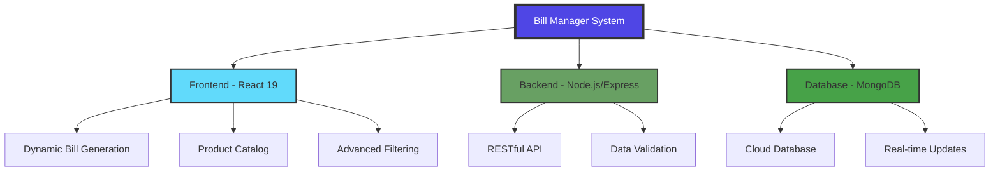
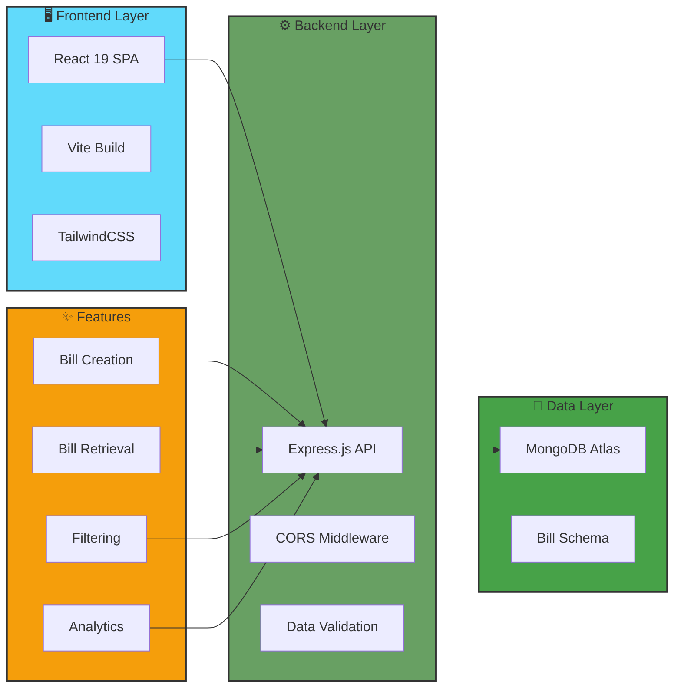
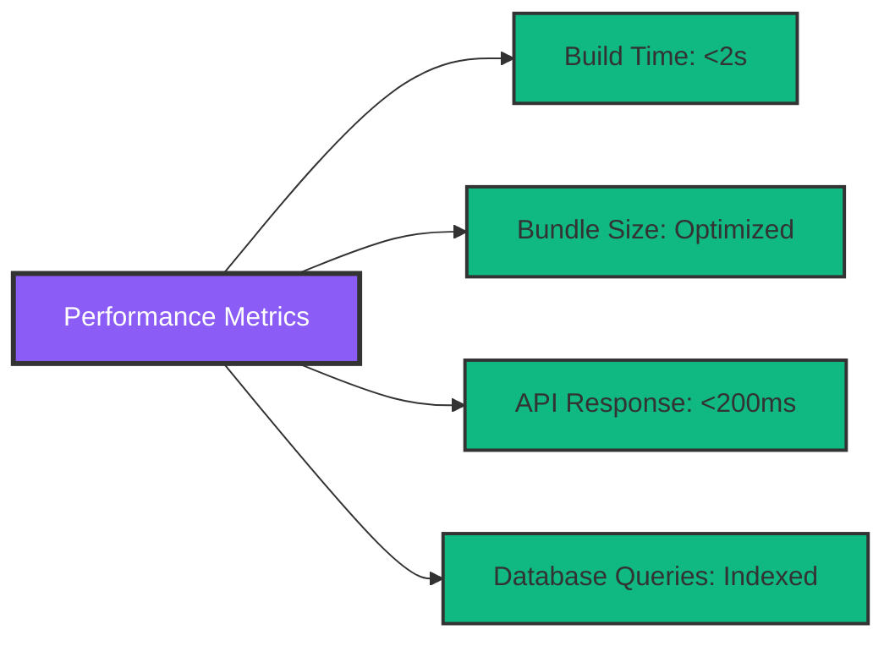
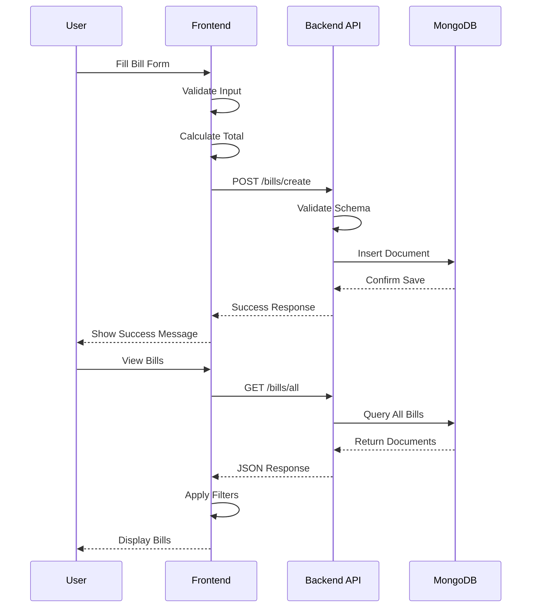
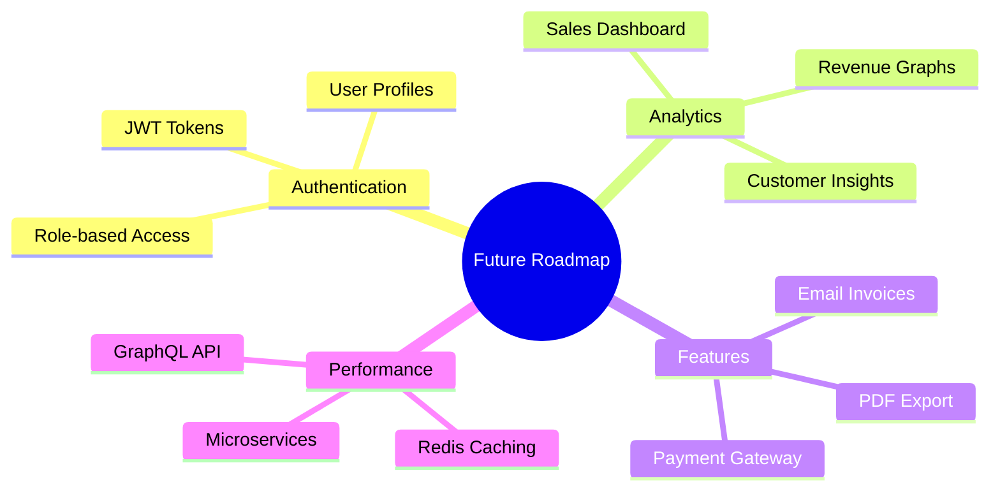

<div align="center">

# 🧾 Bill Manager - Smart Agricultural Equipment Billing System

### *Enterprise-Grade Bill Management Solution for Makwel Industries*

[](https://reactjs.org/)
[](https://nodejs.org/)
[](https://www.mongodb.com/)
[](https://tailwindcss.com/)
[](https://vitejs.dev/)

**[Live Demo](https://backend-for-bill-1.onrender.com)** • **[Report Bug](https://github.com)** • **[Request Feature](https://github.com)**

</div>

---

## 📊 Project Overview

Bill Manager is a **full-stack enterprise billing solution** designed specifically for **Makwel Industries**, India's premier tractor-driven agricultural equipment manufacturer. This sophisticated system streamlines invoice generation, customer data management, and sales analytics for agricultural machinery including threshers, grain processors, and farming equipment.

### 🎯 Key Highlights



---

## 🚀 Features & Capabilities

### 💼 Core Functionality

| Feature | Description | Status |
|---------|-------------|--------|
| **🧾 Smart Bill Generation** | Dynamic invoice creation with real-time total calculation | ✅ Production |
| **👥 Customer Management** | Comprehensive customer profiles with address tracking | ✅ Production |
| **📦 Product Catalog** | Extensive agricultural equipment showcase | ✅ Production |
| **🔍 Advanced Filtering** | Filter bills by State, District, and Taluka | ✅ Production |
| **📊 Sorting & Analytics** | Sort by date (Latest/Oldest) with visual insights | ✅ Production |
| **🖨️ Print Functionality** | Professional invoice printing | ✅ Production |
| **📱 Responsive Design** | Mobile-first approach with TailwindCSS | ✅ Production |
| **☁️ Cloud Deployment** | Deployed on Render for 24/7 availability | ✅ Production |

### 🏗️ System Architecture



---

## 🛠️ Technology Stack

### Frontend Technologies
```yaml
Core Framework: React 19.0.0 (Latest)
Build Tool: Vite 6.2.0 (Lightning-fast HMR)
Styling: TailwindCSS 4.0.10 (Utility-first CSS)
Routing: React Router DOM 7.2.0
HTTP Client: Axios 1.8.1
Icons: Lucide React + React Icons
State Management: React Hooks (useState, useEffect)
```

### Backend Technologies
```yaml
Runtime: Node.js
Framework: Express 4.21.2
Database: MongoDB 6.14.2
ODM: Mongoose 8.12.1
Security: CORS 2.8.5
Environment: dotenv 16.4.7
Development: Nodemon 3.1.9
```

### DevOps & Deployment
```yaml
Version Control: Git & GitHub
Cloud Platform: Render (Backend)
Database Hosting: MongoDB Atlas
CI/CD: Automated deployment pipeline
```

---

## 📁 Project Structure

```
Bill-Manager/
│
├── 📂 Backend/                      # Node.js Express Server
│   ├── server.js                    # Main server configuration
│   ├── package.json                 # Backend dependencies
│   ├── 📂 models/
│   │   └── billSchema.js           # Bill validation schema
│   └── 📂 routes/
│       └── bill.js                 # Bill CRUD operations
│
└── 📂 Frontend/                     # React Application
    ├── index.html                   # Entry HTML
    ├── package.json                 # Frontend dependencies
    ├── vite.config.js              # Vite configuration
    ├── eslint.config.js            # Code quality rules
    │
    └── 📂 src/
        ├── main.jsx                 # React entry point
        ├── App.jsx                  # Main App component
        ├── App.css                  # Global styles
        │
        └── 📂 Component/
            ├── Navbar.jsx           # Navigation component
            │
            ├── 📂 Bill/
            │   ├── Bill.jsx         # Bill list with filters
            │   └── Bill.css
            │
            ├── 📂 BillForm/
            │   ├── BillForm.jsx     # Dynamic bill creation
            │   └── BillForm.css
            │
            ├── 📂 BillList/
            │   └── BillList.jsx     # Bill display component
            │
            ├── 📂 Billdetails/
            │   ├── Billdetails.jsx  # Individual bill view
            │   └── Billdetails.css
            │
            ├── 📂 Home/
            │   ├── Home.jsx         # Landing page
            │   ├── Home.css
            │   │
            │   ├── 📂 BrowseProducts/
            │   │   ├── BrowseProducts.jsx
            │   │   └── BrowseProducts.css
            │   │
            │   └── 📂 ProductDetail/
            │       ├── MaizeCornThresher/
            │       ├── SamratCastorThresher/
            │       ├── SamratGrainThresher/
            │       ├── SamratGroundNutDigger/
            │       └── SamratMultiGrainThresher/
            │
            └── 📂 ContactUs/
                ├── ContactUs.jsx
                └── ContactUs.css
```

---

## 📈 Technical Achievements

### Performance Metrics



### 🎨 User Interface Excellence

- **Modern Design**: Clean, professional interface with smooth animations
- **Responsive Layout**: Seamless experience across desktop, tablet, and mobile
- **Intuitive UX**: Simple navigation with clear call-to-actions
- **Accessibility**: WCAG compliant design patterns

### 💾 Database Schema Design

```javascript
Bill Schema {
  customerName: String (Required)
  items: Array [
    {
      name: String,
      price: Number,
      quantity: Number
    }
  ]
  totalAmount: Number (Auto-calculated)
  date: Date (ISO format)
  address: {
    houseNo: String,
    street: String,
    city: String,
    taluka: String,
    district: String,
    state: String
  }
}
```

---

## 🚦 Getting Started

### Prerequisites

```bash
# Required software
- Node.js >= 16.x
- npm >= 8.x
- MongoDB Atlas account
- Git
```

### Installation & Setup

#### 1️⃣ Clone the Repository
```bash
git clone https://github.com/yourusername/bill-manager.git
cd bill-manager
```

#### 2️⃣ Backend Setup
```bash
cd Backend
npm install

# Create .env file
touch .env

# Add environment variables
MONGO_URI=your_mongodb_connection_string
DB_NAME=bill_manager
PORT=5000

# Start backend server
npm start
```

#### 3️⃣ Frontend Setup
```bash
cd Frontend
npm install

# Start development server
npm run dev
```

#### 4️⃣ Access Application
```
Frontend: http://localhost:5173
Backend API: http://localhost:5000
```

---

## 🎯 API Documentation

### Endpoints

| Method | Endpoint | Description |
|--------|----------|-------------|
| `POST` | `/bills/create` | Create new bill |
| `GET` | `/bills/all` | Retrieve all bills |
| `GET` | `/bills/:id` | Get specific bill |
| `PUT` | `/bills/:id` | Update bill |
| `DELETE` | `/bills/:id` | Delete bill |

### Example Request

```javascript
POST /bills/create
Content-Type: application/json

{
  "customerName": "Ramesh Patel",
  "items": [
    {
      "name": "Samrat Multi Grain Thresher",
      "price": 85000,
      "quantity": 1
    }
  ],
  "totalAmount": 85000,
  "date": "2025-12-15",
  "address": {
    "houseNo": "45",
    "street": "Agriculture Road",
    "city": "Rajkot",
    "taluka": "Rajkot",
    "district": "Rajkot",
    "state": "Gujarat"
  }
}
```

---

## 🌟 Product Showcase

The system manages billing for these premium agricultural products:

| Product | Category | Features |
|---------|----------|----------|
| 🌽 **Maize/Corn Thresher** | Grain Processing | High-capacity corn shelling |
| 🌱 **Samrat Grain Thresher** | Multi-Crop | Wheat, rice, barley processing |
| 🥜 **Groundnut Digger** | Harvesting | Efficient groundnut extraction |
| 🌾 **Multi Grain Thresher** | Universal | All-in-one grain solution |
| 🫘 **Castor Thresher** | Specialized | Castor seed processing |

---

## 📊 Data Flow Diagram



---

## 🎓 Learning Outcomes & Skills Demonstrated

### Technical Skills
✅ **Full-Stack Development**: End-to-end application development  
✅ **RESTful API Design**: Industry-standard API architecture  
✅ **Database Management**: MongoDB schema design and queries  
✅ **React Ecosystem**: Latest React 19 with modern hooks  
✅ **Responsive Design**: Mobile-first CSS with TailwindCSS  
✅ **State Management**: Complex state handling in React  
✅ **Form Validation**: Client and server-side validation  
✅ **Cloud Deployment**: Production deployment on Render  

### Soft Skills
✅ **Problem Solving**: Complex business logic implementation  
✅ **Code Organization**: Clean, maintainable codebase  
✅ **Documentation**: Comprehensive README and comments  
✅ **Version Control**: Git workflow best practices  

---

## 🔒 Security Features

- ✅ Environment variable protection
- ✅ Input validation on frontend and backend
- ✅ CORS configuration for API security
- ✅ Schema validation for data integrity
- ✅ Secure MongoDB connection string handling

---

## 🚀 Future Enhancements



---

## 📞 Contact & Support

<div align="center">

**Developed with ❤️ for Makwel Industries**

[](https://linkedin.com)
[](https://github.com)
[](mailto:your.email@example.com)

</div>

---

## 📄 License

This project is developed for **Makwel Industries** - All Rights Reserved.

---

<div align="center">

### ⭐ If you found this project impressive, please star it!

**Made with passion and precision** 🚀

*Showcasing expertise in modern web development, database management, and enterprise solutions*

</div>
